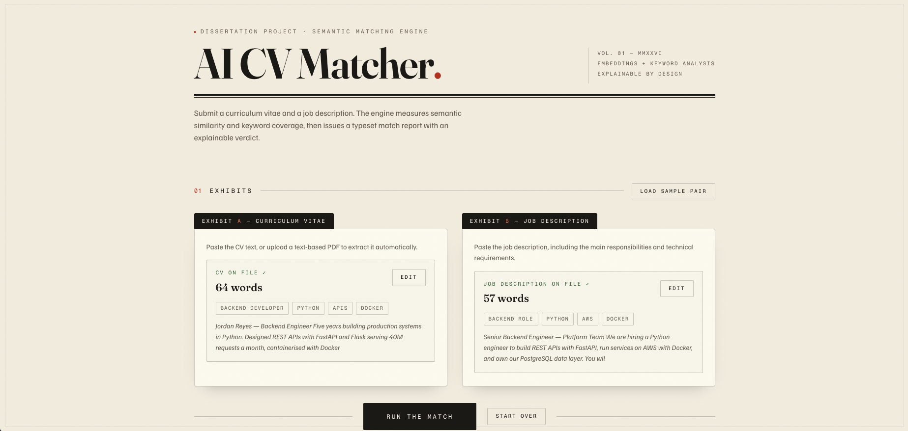

# AI CV Matcher — The Match Report

A full-stack web app that compares a CV against a job description and issues a typeset **match report**: a semantic similarity score, keyword coverage, matched and missing skills, and an explainable verdict — stamped like a real assessment document.

## Live demo

**[dissertation-hazel.vercel.app](https://dissertation-hazel.vercel.app/?utm_source=portfolio)**

Click **Load sample pair → Run the Match** for the two-click tour.



> This is a demo and research prototype — not intended for real recruitment decision-making.

## What it does

- **Semantic similarity** — CV and job description are embedded with `openai/text-embedding-3-small` (served through OpenRouter) and compared by cosine similarity, calibrated to the model's real working range so unrelated text scores near 0%.
- **Keyword coverage** — detects technical skills on both sides (with aliases and equivalent-framework groups) and measures how much of the job's requirements the CV covers.
- **Explainable verdict** — final score (70% semantic + 30% keyword), a Strong/Moderate/Weak stamp, matched and missing skill chips, and a plain-language recommendation. No black box.
- **PDF CV upload** — extracts text from text-based PDF CVs server-side.
- **Anonymization** — strips emails, phone numbers, and titles from the CV before scoring.
- **Session ledger** — every match is persisted to Postgres, but each visitor only ever sees (and can only delete) the matches from their own browser session.

## Tech stack

| Layer | Tech |
|---|---|
| Frontend | React 18 + Vite, custom editorial design system (Fraunces / Familjen Grotesk / Fragment Mono) |
| Backend | FastAPI (Python), deployed as a Vercel serverless function |
| Embeddings | OpenRouter (OpenAI-compatible API) |
| Database | Supabase (Postgres) |
| Hosting | A single Vercel project serves both the static frontend and the `/api/*` function |

### Architecture

`vercel.json` rewrites every `/api/*` request to `api/index.py`, which loads the FastAPI app from `main.py`. Frontend and API share one domain, so there is no CORS configuration and no API base URL to manage. Secrets (`OPENROUTER_API_KEY`, `SUPABASE_URL`, `SUPABASE_KEY`) live only in server-side environment variables; the browser never talks to Supabase or OpenRouter directly.

## Run it locally

Requirements: Python 3.10+, Node 18+.

```bash
git clone https://github.com/lucaalberto-giorgi/dissertation.git
cd dissertation

# 1. Environment
cp .env.example .env       # then fill in the three values

# 2. Backend (terminal 1)
python3 -m venv venv
source venv/bin/activate
pip install -r requirements.txt
uvicorn main:app --reload  # http://127.0.0.1:8000, Swagger at /docs

# 3. Frontend (terminal 2)
npm install
npm run dev                # http://localhost:5173 — /api proxies to the backend
```

## API

| Endpoint | Description |
|---|---|
| `POST /api/match` | Score a CV against a job description; returns scores, skills, explanation, and the saved record id |
| `POST /api/extract-cv-pdf` | Extract text from an uploaded PDF CV |
| `GET /api/matches` | List recent saved match records (safe columns only — never the raw CV or job text) |
| `DELETE /api/matches/{id}` | Delete a saved match record |

Example:

```bash
curl -X POST "http://127.0.0.1:8000/api/match" \
  -H "Content-Type: application/json" \
  -d '{
    "cv_text": "Python developer with FastAPI, NumPy and machine learning experience.",
    "job_description": "Hiring a Python developer with FastAPI and NumPy knowledge."
  }'
```

## How the scoring works

1. The CV is anonymized, then both texts are normalized and embedded.
2. Cosine similarity is rescaled from the embedding model's practical range (~0.2–0.85) onto 0–1 — so gibberish reads as ~0%, not an inflated 50%+.
3. Skill detection compares required skills from the job against skills found in the CV, tolerating aliases (e.g. "postgres" → PostgreSQL) and equivalent frameworks (e.g. Flask ≈ FastAPI).
4. Final score = 70% semantic + 30% keyword, with a small bonus only when the job's detected requirements are fully covered.
5. Thresholds: **Strong ≥ 70%**, **Moderate ≥ 45%**, otherwise **Weak** — and a match with zero overlapping skills is always Weak, regardless of score.

## Project origin

Built originally as an MSc dissertation project on explainable CV–job matching, then reworked into the portfolio piece you see today: redesigned UI, recalibrated scoring, and a serverless deployment. The `scripts/` folder still contains the dataset-evaluation tooling from the research phase.
